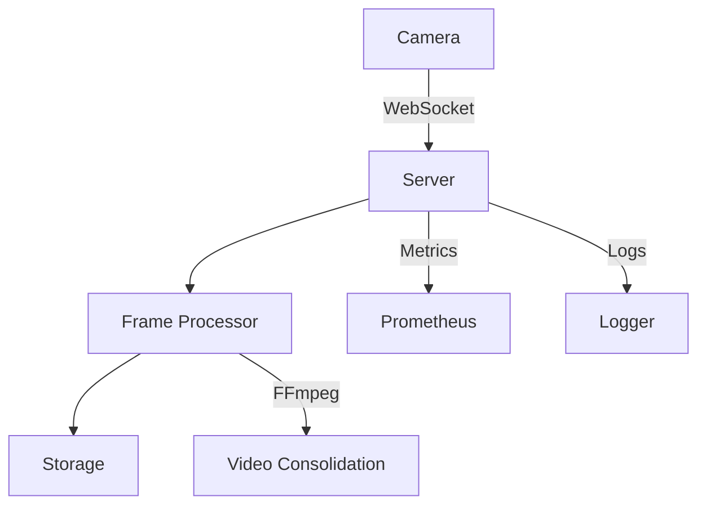

# Enterprise CCTV Streaming System

A lightweight, Go-based CCTV streaming system with real-time frame processing and video consolidation capabilities. The system supports websocket-based camera connections, frame processing, and automatic video generation.

## Core Components

### Server Components

- `server.go`: Core WebSocket server implementation that handles camera connections and frame receiving. Manages the lifecycle of camera connections and provides endpoints for health checks and metrics.
- `processor.go`: Handles frame processing, storage, and video consolidation. Contains the logic for saving frames and creating videos from captured frames.
- `camera.go`: Manages individual camera connections, handles signal and stream servers, and processes camera events.
- `encoder.go`: Provides FFmpeg-based video encoding capabilities for real-time streaming.

### Configuration & Utils

- `config.go`: Configuration management using Viper, handles server, stream, and storage settings.
- `logger.go`: Enhanced logging system with UI capabilities using Bubble Tea, supports log rotation and multiple outputs.
- `metrics.go`: Prometheus metrics implementation for monitoring system performance.

### Build & Setup Scripts

- `build.sh`: Main build script that handles dependencies, compilation, and initial setup.
- `setup.sh`: System setup script for initial configuration and testing.

## Architecture



## Key Features

### Frame Processing Pipeline

1. Frames received via WebSocket are base64 decoded
2. Processed frames are saved to disk with metadata
3. Automatic video consolidation when frame threshold is reached
4. Configurable cleanup of processed frames

### Monitoring & Logging

- Real-time metrics via Prometheus
- Enhanced logging with UI capabilities
- Health check endpoints
- Debug endpoints for system inspection

### Camera Management

- Automatic camera discovery and connection
- Keep-alive with ping/pong
- Graceful connection handling
- Support for multiple camera streams

## Getting Started

### Prerequisites

- Go 1.21 or higher
- FFmpeg (for video consolidation)
- Git

### Quick Start

1. Clone the repository:

```bash
git clone https://github.com/yourusername/cctv-system.git
cd cctv-system
```

2. Run the setup script:

```bash
chmod +x setup.sh
./setup.sh
```

### Configuration

The system is configured through `config.yaml`:

```yaml
log_level: "debug"

server:
  host: "localhost"
  port: 8080
  signal_port: 8081
  stream_port: 8082

stream:
  video_codec: "h264"
  video_bitrate: 2000
  framerate: 30
  width: 1280
  height: 720

storage:
  output_dir: "./frames"
  save_frames: true
  max_frames: 1000
  retention_hours: 24
```

## Architecture Deep Dive

### Frame Processing Logic

1. Frames are received by `server.go` via WebSocket
2. `processor.go` handles frame storage and processing
3. When frame threshold is reached, video consolidation begins
4. FFmpeg processes frames into a video file
5. Original frames can be optionally cleaned up

### Monitoring System

- Real-time metrics tracking
- Frame processing rates
- Error tracking
- System health monitoring

### Logging System

- Multi-level logging (debug, info, warn, error)
- Log rotation
- Console and file outputs
- Interactive UI for log viewing

## Development

### Building

```bash
make build      # Build all components
make run-server # Run the server
make run-sim    # Run the simulator
```

### Testing

```bash
go test ./...   # Run all tests
```

## Contributing

1. Fork the repository
2. Create your feature branch
3. Commit your changes
4. Push to the branch
5. Create a Pull Request

## Known Issues & Future Improvements

1. Video consolidation process needs optimization for large frame counts
2. Memory usage during video creation could be improved
3. More robust error handling for FFmpeg failures
4. Enhanced camera discovery mechanism
5. Support for more video codecs

## License

Distributed under the MIT License. See `LICENSE` for more information.

## Contact

- Discord: [discord.com/guynamedchiso](https://discord.com/guynamedchiso)
- Email: [chiboguchisomu@gmail.com](mailto:chiboguchisomu@gmail.com)
